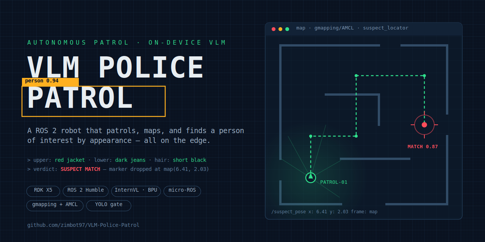
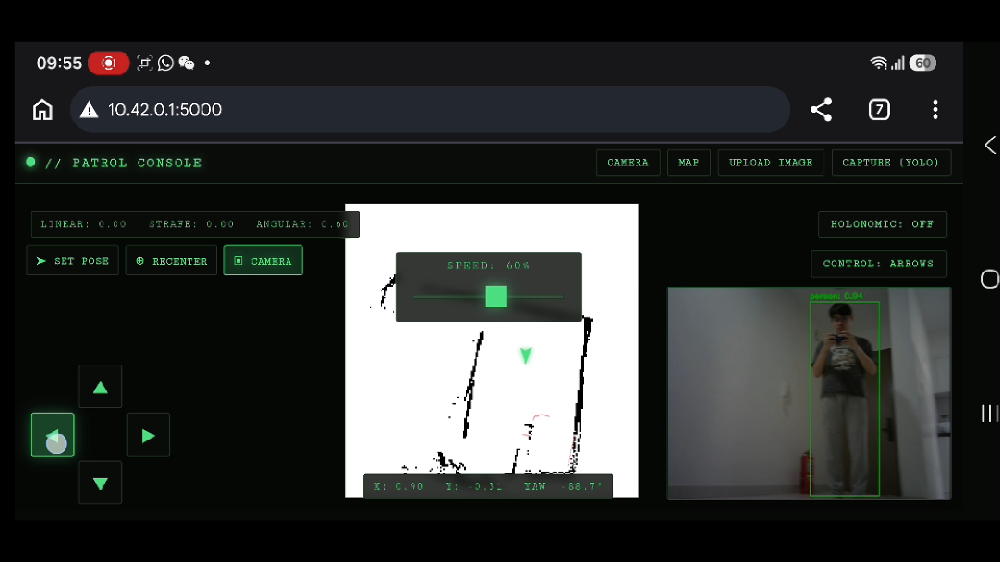
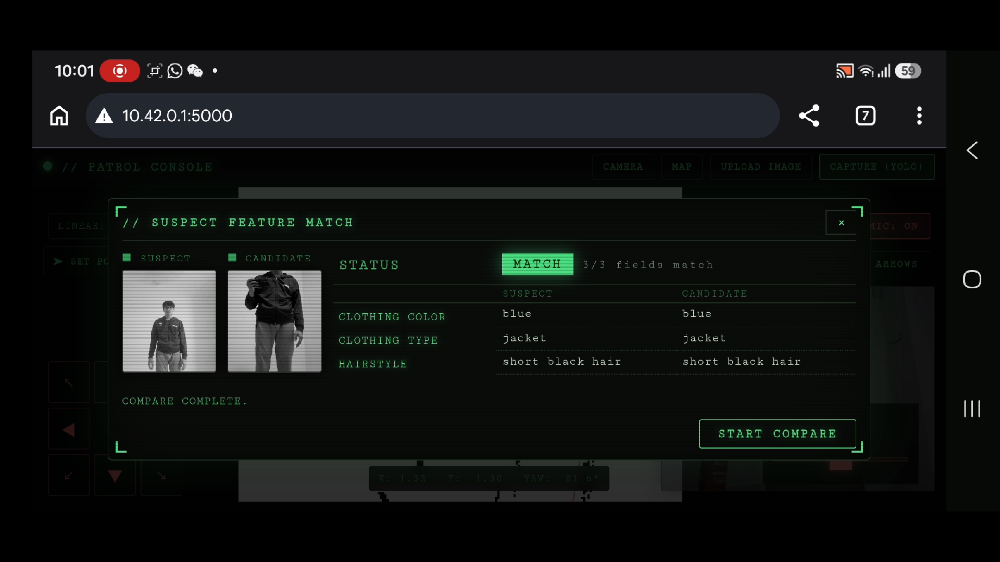
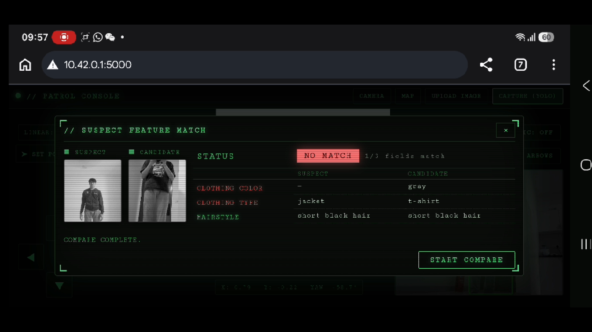
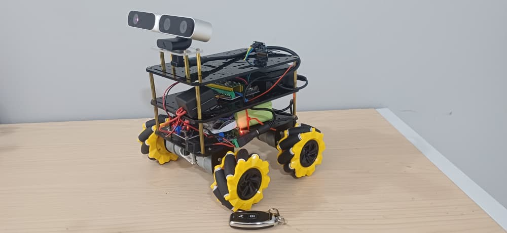
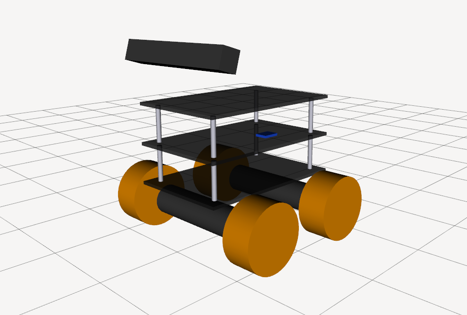
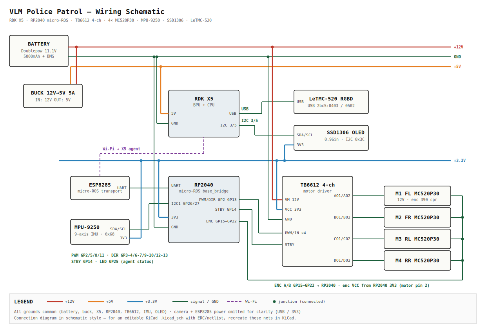
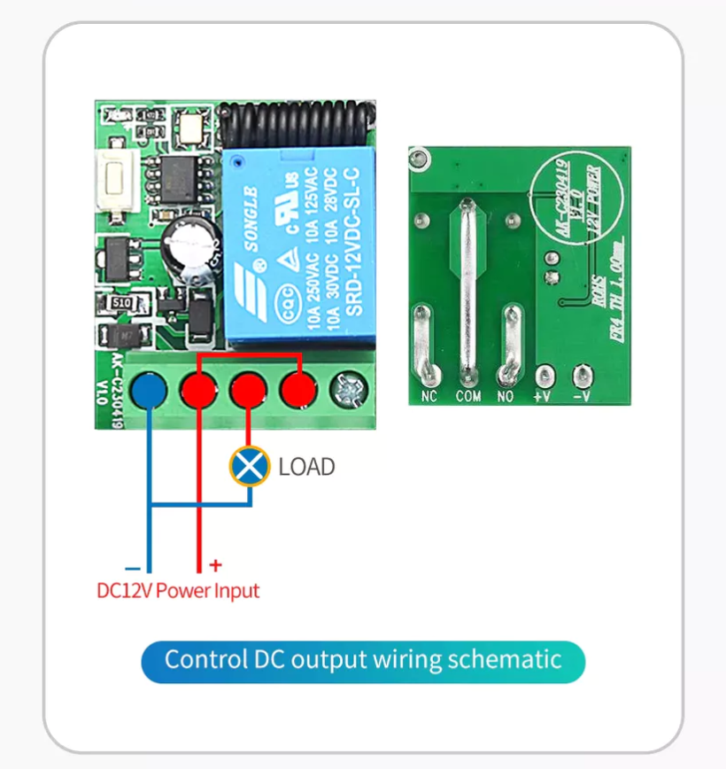

# VLM Police Patrol

An autonomous patrol robot built on the **D-Robotics RDK X5** that detects people
with on-board YOLO (BPU), triages them against an operator-supplied reference photo
using a Vision-Language Model (VLM), and localizes matches on a live SLAM map — all
driven from a Flask web dashboard.

> **Surface-feature triage only** — this compares visible appearance (clothing
> color/type, hair, etc.), *not* face recognition or confirmed identity.

See [docs/technical.md](docs/technical.md) for the full engineering reference
(architecture, package inventory, ROS 2 graph, calibration, known issues) and
[docs/benchmarks.md](docs/benchmarks.md) for inference benchmarks.

---

## Demo

**Live patrol console** — the Flask dashboard streaming real-time YOLO person detection
(`person: 0.94`), the SLAM map with the robot pose, and holonomic teleop:



**Suspect feature match** — the VLM compares a reference photo against the captured
candidate by clothing colour/type and hairstyle:

| ✅ Match (3/3 fields) | ❌ No match (1/3 fields) |
|----------------------|--------------------------|
|  |  |

Same suspect → `blue / jacket / short black hair` matches on all three fields. Different
person → clothing colour and type differ, so the result is **NO MATCH**.

---

## Quick Start (clone → build → launch)

```bash
# 1. Clone into a ROS 2 workspace
mkdir -p ~/ros2_ws/src && cd ~/ros2_ws/src
git clone https://github.com/zimbot97/VLM-Police-Patrol.git .
# NOTE: SLAM (slam_gmapping_Humble) is built on a SEPARATE laptop, not the robot —
#       see Networking + SLAM below.

# 2. Build (memory-limited for the X5 — see Prerequisites)
cd ~/ros2_ws
export MAKEFLAGS="-j2"
colcon build \
  --cmake-args -DPLATFORM_X5=ON \
  --parallel-workers 4 \
  --event-handlers console_direct+ \
  --merge-install
source /opt/ros/humble/setup.bash
source ~/ros2_ws/install/setup.bash

# 3. Launch the whole stack
bash ~/ros2_ws/sh/master.sh
```

Then open the Flask dashboard in a browser (the OLED shows the device IP on `wlan0`).

---

## System integration overview (Challenge 1)

A single coherent system integrating on-board AI, ROS 2, motor control, and sensor fusion:

| Requirement | How it's met |
|-------------|--------------|
| **AI model(s) on board** | YOLO11n person detector + InternVL2.5-1B VLM, both BPU-accelerated on the RDK X5 (see [Challenge 2](#real-time-ai-inference-challenge-2)) |
| **ROS 2 communication** | All nodes talk over ROS 2 Humble topics/services — see the [connection map in docs/technical.md](docs/technical.md#15-cross-package-relationship-map) |
| **Motor / actuator control + safety limits** | RP2040 (Pico) mecanum firmware over micro-ROS, with documented limits (see [Motor control & safety](#motor-control--safety)) |
| **Sensor fusion / multi-sensor timing** | EKF fuses wheel odometry + IMU; depth+detection time-paired for localization (see [Sensor fusion](#sensor-fusion--timing)) |

**Entrypoint:** [`sh/master.sh`](sh/master.sh) is the single launch script; each
component also has its own script under [`sh/`](sh/) and a ROS 2 launch file (see
[What it starts](#what-it-starts-in-order)).

---

## Prerequisites

- **Hardware:** RDK X5, Astra depth camera, RP2040 (Pico) mecanum base + IMU, OLED status display, 11.1 V battery.

| Real robot | URDF model (RViz) |
|------------|-------------------|
|  |  |

*Left: the assembled robot — 3-layer acrylic chassis, 4 mecanum wheels, RGB-D camera bar,
and the RF key-fob hardware E-stop. Right: the matching URDF model. Full description and TF
tree in [`police_patrol_bot_description`](./src/police_patrol_bot_description/README.md).*

- **Software:** RDK OS ≥ 3.5.0 (Ubuntu 22.04.5 LTS, kernel 6.1.83 aarch64), ROS 2 **Humble** (TROS-Humble), workspace built and installed at `~/ros2_ws`.
- **Models staged on device:**
  - YOLO: `/home/sunrise/rdk_model_zoo/samples/vision/ultralytics_yolo/model/yolo11n_detect_bayese_640x640_nv12.bin`
  - VLM (InternVL2.5-1B): `/home/sunrise/models/internvl2_5_1b/vit_model_int16_v2.bin` + `Qwen2.5-0.5B-Instruct-Q4_0.gguf`
- **Runtime deps:** `xterm` (each node launches in its own held terminal).

### Networking

The **RDK X5 creates its own Wi-Fi hotspot** so the robot and the SLAM laptop share one
network in the field (no external router needed):

| Setting | Value |
|---------|-------|
| SSID | `police_patrol` |
| Password | `123456789` |

- The **SLAM laptop** (running `slam_gmapping`) and any operator browser connect to this
  hotspot. All machines must use the **same `ROS_DOMAIN_ID`** so ROS 2 discovery works
  across them.
- The OLED shows the X5's IP on `wlan0`; open the Flask dashboard at
  `http://<that-ip>:<port>` from a device on the same hotspot.

### Wiring



The build command is in [Quick Start](#quick-start-clone--build--launch). On the
RDK X5, `export MAKEFLAGS="-j2"` limits per-package compile jobs so the build does not
run out of memory, and `--parallel-workers 4` bounds how many packages build at once.

> **SLAM / mapping (runs off-board):** Maps are built with
> [GMHadou/slam_gmapping_Humble](https://github.com/GMHadou/slam_gmapping_Humble.git)
> (GMapping ported to ROS 2 Humble). To keep CPU/BPU load off the RDK X5, `slam_gmapping`
> runs on a **separate laptop** that shares the same ROS 2 network (same `ROS_DOMAIN_ID`)
> over Wi-Fi — see [Networking](#networking). Clone and build it there; the robot only
> needs to publish scans/TF/odom for the laptop to consume. The `slam_gmapping`
> parameters used for this robot are:
>
> ```yaml
> slam_gmapping:
>   ros__parameters:
>     base_frame: "base_link"
>     odom_frame: "odom"
>     map_frame:  "map"
>     map_update_interval:  5.0
>
>     # Default: autodetect. Set maxUrange and maxRange for manual settings
>     maxUrange:          4.0
>     maxRange:           5.0
>     minimumScore:         20
>
>     sigma:                0.05
>     kernelSize:           1
>     lstep:                0.05
>     astep:                0.05
>     iterations:           5
>     lsigma:               0.075
>     ogain:                3.0
>     lskip:                0
>
>     srr:                  0.05
>     srt:                  0.05
>     str:                  0.05
>     stt:                  0.05
>
>     linearUpdate:         0.2
>     angularUpdate:        0.3
>     temporalUpdate:       1.0
>
>     resampleThreshold:    0.5
>     particles:            30
>
>     # Initial Map Size & Resolution
>     xmin:                -5.0
>     ymin:                -5.0
>     xmax:                 5.0
>     ymax:                 5.0
>     delta:                0.05
>
>     llsamplerange:        0.01
>     llsamplestep:         0.01
>     lasamplerange:        0.005
>     lasamplestep:         0.005
>
>     transform_publish_period:  0.05
>     occ_thresh:           0.25
>
>     tf_delay:             0.1
> ```

**SLAM demo** — sped-up run of the map building from the robot's point of view:

https://github.com/user-attachments/assets/23d59549-206d-421f-9495-abf1c81d5321

More clips (raw video, original speed): ▶️ [slam_fov.mp4](docs/videos/slam/slam_fov.mp4) · ▶️ [map.mp4](docs/videos/slam/map.mp4)

---

## Hardware assembly

The robot is built on a **3-layer mecanum chassis** (four 60 mm mecanum wheels with
TT gear-motor + encoders). We used this kit:
**[AliExpress — mecanum chassis](https://www.aliexpress.com/item/1005012241260865.html)**.

The three acrylic plates (base plate is 128 × 198 mm — see hole layout in
[docs/images/mpu9250_placement.png](docs/images/mpu9250_placement.png)):

| Plate | Mounts |
|-------|--------|
| **Bottom** | 4× mecanum motors + wheels, 11.1 V battery, motor driver |
| **Second (middle)** | RP2040 (Pico) firmware board, **MPU9250 IMU** |
| **Top** | RDK X5, depth-camera bar, OLED status display |

### Mounting the MPU9250 IMU (second plate)

Mount the MPU-9250 board on the **middle plate**, roughly centered near the Ø10 hub hole,
per [docs/images/mpu9250_placement.png](docs/images/mpu9250_placement.png):

- Orient the board so its **+X axis points to the robot's front** (align with the plate
  arrow) — the URDF `imu_joint` assumes this orientation.
- Keep it **flat and rigid** (double-sided foam tape or standoffs); flex or tilt shows up
  as EKF drift.
- Wire to the Pico's **I2C1** (`SDA=GP26`, `SCL=GP27`, `400 kHz`, address `0x68`) as in the
  [wiring schematic](docs/images/schematic.svg).
- Keep the robot **still at power-on** — gyro bias is sampled at boot (see
  [docs/technical.md §2.2](docs/technical.md#22-imu-mpu9250)).

### Camera position

The depth camera is described in the URDF as a fixed `camera_joint` on `base_link`. To
change its mount (height, forward offset, or pitch), edit the joint origin in
[`urdf/mecanum_robot.urdf.xacro`](src/police_patrol_bot_description/urdf/mecanum_robot.urdf.xacro):

```xml
<joint name="camera_joint" type="fixed">
  <parent link="base_link"/>
  <child  link="camera_link"/>
  <!-- xyz = forward, left, up (m); rpy pitch -16° tilts +X (forward) upward -->
  <origin xyz="0.090 0 ${2*layer_dz + 0.060}" rpy="0 ${radians(-16)} 0"/>
</joint>
```

Match the physical camera bar to whatever you set here, then rebuild
`police_patrol_bot_description` so TF reflects reality (bad camera TF = wrong suspect
localization). See [`police_patrol_bot_description`](src/police_patrol_bot_description/README.md).

### Hardware E-stop relay (RF)

A wireless **RF relay module** (SRD-12VDC-SL-C, 12 V receiver) is wired **in series with
the motor-driver power feed** so a key-fob press physically cuts drive power — a true
hardware E-stop, independent of ROS/software. We used this module:
**[Shopee — 12 V RF relay + remote](https://shopee.com.my/product/188678203/43382344394)**.

Wiring (per the module's "Control DC output" schematic):

| Relay terminal | Connect to |
|----------------|------------|
| `+V` / `−V` | 12 V power input (battery side) |
| `COM` | 12 V **+** from battery |
| `NO` | **+V of the motor driver** — this is the `LOAD` |
| (motor driver −) | battery **−** directly |

The relay's **`LOAD` is the motor driver**: the 12 V rail to the driver passes through
`COM → NO`, so the RF remote (or the relay button) opening the contact de-energizes the
driver and the wheels stop immediately. Logic power (RDK X5 / Pico) is **not** routed
through the relay, so the compute stack keeps running and the software `cmd_vel` watchdog
still brakes on its own. Use `NO` (normally-open) so the default state is "motors off
until armed".



*Control-DC-output wiring: 12 V power input to the relay, `COM`/`NO` in series with the
motor-driver `+V` (the `LOAD`), so the RF remote cuts drive power.*

---

## One-shot launch

[`sh/master.sh`](sh/master.sh) brings the entire stack up in order, spacing each
node by 2 s so dependencies (transforms, camera, VLM) are ready before consumers
start:

```bash
bash ~/ros2_ws/sh/master.sh
```

Each step opens an `xterm` (`-hold`) so logs stay visible per component.

### What it starts, in order

| # | Script | Launches | Purpose |
|---|--------|----------|---------|
| 1 | [`bringup.sh`](sh/bringup.sh) | `police_patrol_bot bringup.launch.py` | Robot base, micro-ROS, TF, IMU/EKF |
| 2 | [`camera.sh`](sh/camera.sh) | `police_patrol_bot camera.launch.py` | Astra RGB-D camera driver |
| 3 | [`yolo.sh`](sh/yolo.sh) | `suspect_matcher yolo_detect` | BPU person detection + candidate crops |
| 4 | [`llamacpp.sh`](sh/llamacpp.sh) | `hobot_llamacpp` | VLM appearance-attribute extraction |
| 5 | [`suspect_matcher.sh`](sh/suspect_matcher.sh) | `suspect_matcher compare.launch.py` | Reference vs. candidate attribute compare |
| 6 | [`amcl.sh`](sh/amcl.sh) | `police_patrol_bot amcl.launch.py` | Map + AMCL localization |
| 7 | [`suspect_localize.sh`](sh/suspect_localize.sh) | `suspect_matcher suspect_localizer` | Freeze suspect map coordinate on match (AMCL pose, or depth centroid) |
| 8 | [`flask.sh`](sh/flask.sh) | `dashboard_flask flask_node` | Web dashboard / teleop |
| 9 | [`oled.sh`](sh/oled.sh) | `oled_status oled_status.launch.py` | On-board status + IP display |

---

## Key parameters

- **YOLO** ([`yolo.sh`](sh/yolo.sh)): `camera_topic:=/camera/color/image_raw`, `keep_conf:=0.7`, `live_view:=true`.
- **VLM** ([`llamacpp.sh`](sh/llamacpp.sh)): `feed_type:=1`, `model_type:=0`, `system_prompt:=config/system_prompt.txt`.
- **Suspect matcher** ([`suspect_matcher.sh`](sh/suspect_matcher.sh)): `reference_image_path:=/tmp/reference_crop.jpg`, `candidate_image_path:=/tmp/candidate_crop.jpg`.
- **Localizer** ([`suspect_localize.sh`](sh/suspect_localize.sh)): `location_source:=amcl_pose` (default; or `pointcloud` for depth-centroid), `min_valid_points:=20`, `tf_timeout_sec:=1.0`.
- **Dashboard** ([`flask.sh`](sh/flask.sh)): `image_topic:=/yolo/image_annotated`, `map_topic:=/map`, `pose_topic:=/amcl_pose`, `cmd_vel_topic:=/cmd_vel`, `holonomic_mode_topic:=/holonomic_mode`.
- **OLED** ([`oled.sh`](sh/oled.sh)): `ip_interface:=wlan0`.

---

## Real-Time AI Inference (Challenge 2)

- **BPU acceleration:** the primary perception model, **YOLO11n**
  (`yolo11n_detect_bayese_640x640_nv12.bin`, 640×640 NV12, int8), runs on the RDK X5
  **BPU** via `hobot_dnn`. The VLM's vision encoder (InternVL2.5-1B ViT) also runs on
  the BPU; its Qwen2.5-0.5B language head runs on CPU via llama.cpp.
- **Real-time detection:** `yolo_detect` consumes the continuous camera stream
  (`/camera/color/image_raw`) and publishes annotated frames to
  `/yolo/image_annotated` — a live stream, not single-frame.
- **Multi-task / two concurrent workloads:**
  1. Continuous YOLO detection on the **BPU**.
  2. On-demand VLM appearance matching — ViT encode on **BPU**, LLM decode on **CPU**,
     so the match workflow overlaps detection without stalling the detection stream.

See the benchmark table (resolution, FPS/latency, model names, tool versions) and the
live-stream capture in **[docs/benchmarks.md](docs/benchmarks.md)**.

**Observed load (full stack + VLM running):** per the OLED status readout, the RDK X5
sits at roughly **~70 °C** and **~90 % CPU** while the whole stack runs and the VLM is
active — yet **teleop stays smooth and responsive**. The VLM's LLM decode is CPU-bound,
which is what pushes CPU high, but because motion control lives on the Pico firmware
(not the X5 CPU), driving is unaffected by the on-board inference load.

---

## Motor control & safety

Motion is handled entirely on the **RP2040 (Pico)** firmware
([`pico_firware/mecanum_base/mecanum_base.cpp`](pico_firware/mecanum_base/mecanum_base.cpp)),
bridged to ROS 2 via `micro_ros_agent`. It subscribes to `/cmd_vel` (Twist) and
publishes `odom`, `wheel_speeds`, and `imu/data_raw`.

**Documented safety limits (firmware constants):**

| Limit | Value | Effect |
|-------|-------|--------|
| `MAX_W` | 20.0 rad/s | Max wheel angular speed; commands are scaled so 100% duty maps to this ceiling |
| `WD_SECS` | 0.5 s | **cmd_vel watchdog** — if no `/cmd_vel` arrives for 0.5 s the firmware brakes all wheels (`all_brake()`) and coasts to a stop |
| I2C transfer timeout | per-transfer guard | A stuck IMU bus cannot hang the control loop |

The watchdog means a dropped dashboard connection, crashed node, or network loss
causes the robot to **stop automatically** rather than run away.

### Safe shutdown / e-stop

- **Software stop:** close the dashboard / stop publishing `/cmd_vel` → the 0.5 s
  watchdog brakes the motors.
- **Hardware E-stop:** an **RF relay** (SRD-12VDC-SL-C) is wired in series with the
  motor-driver power feed (`COM → NO`, `LOAD` = motor driver). A key-fob press opens the
  contact and physically cuts drive power — independent of ROS/software. Logic power
  (X5/Pico) is not routed through it, so the software watchdog stays active too. Wiring in
  [Hardware E-stop relay (RF)](#hardware-e-stop-relay-rf).

---

## Sensor fusion & timing

- **Odometry + IMU (EKF):** [`config/ekf.yaml`](src/police_patrol_bot/config/ekf.yaml)
  runs `robot_localization`'s EKF at **30 Hz** (`sensor_timeout: 0.2 s`, `two_d_mode`),
  fusing wheel-odometry body velocities (`/odom`, vx/vy/vyaw) with MPU9250 IMU
  (`/imu/data_raw`, yaw-rate + accel, gravity removed). It publishes the
  `odom → base_footprint` TF and `/odometry/filtered`. Only velocities from odom are
  fused (not absolute pose) to avoid double-counting the Pico's own integration.
- **Detection → capture-time freeze:** the `suspect_localizer` node treats each
  `/yolo/detections` message as a capture event and **freezes** the suspect location at
  that instant (the VLM compare can take minutes, during which the robot/person may
  move, so nothing is re-sampled afterwards). The frozen fix is emitted only when
  `/suspect_feature_match` is `true`. Placement depends on `location_source`:
  - `amcl_pose` (default) — the robot's own map-frame pose (`/amcl_pose`) at the capture
    moment; cheapest, no depth/TF.
  - `pointcloud` — the centroid of valid depth points inside the largest person bbox,
    grabbed on demand from `/camera/depth_registered/points` (organized cloud, so the
    pixel bbox maps directly to points), transformed to `map` via tf2 using the cloud's
    own stamp. Guarded by `min_valid_points` and `tf_timeout_sec`.

---

## Core skills / competency checklist

| Competency | Where |
|------------|-------|
| End-to-end bring-up & reproducible builds | [Quick Start](#quick-start-clone--build--launch), `--merge-install` + pinned launch scripts under [`sh/`](sh/) |
| Model conversion / deployment for RDK | BPU `.bin` models (bayes-e int8 YOLO, int16 ViT) staged per [Prerequisites](#prerequisites); benchmarks in [docs/](docs/benchmarks.md) |
| ROS 2 performance tuning | On-demand (service-triggered) VLM to keep the BPU detection stream free; watchdog-driven control; see [docs/technical.md](docs/technical.md) |
| System profiling & thermal / power awareness | Live OLED readout of temp/CPU (~70 °C, ~90 % CPU with the full stack + VLM, teleop still smooth — see [Challenge 2](#real-time-ai-inference-challenge-2)); `MAKEFLAGS="-j2"` + `--parallel-workers 4` to bound build memory on the X5; 11.1 V battery + power distribution per the [wiring schematic](docs/images/schematic.svg); BPU/CPU split in [docs/benchmarks.md](docs/benchmarks.md) |

---

## Using the system

1. Run `master.sh` and wait for all nine terminals to come up.
2. Open the Flask dashboard in a browser (the OLED shows the device IP on `wlan0`).
3. Provide a **reference image** of the suspect via the dashboard.
4. Drive the robot (holonomic mecanum teleop). As YOLO detects people, candidate
   crops are matched against the reference by the VLM.
5. Confirmed matches are localized on the SLAM map as suspect coordinates.

---

## Launching individual components

Any component can be run on its own for debugging — just invoke its script:

```bash
bash ~/ros2_ws/sh/camera.sh
bash ~/ros2_ws/sh/yolo.sh
```

## Shutting down

Close each `xterm`, or:

```bash
pkill -f xterm
```
