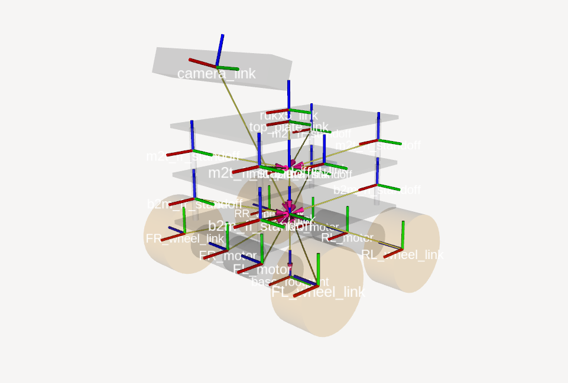
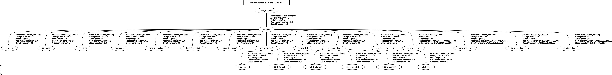

# police_patrol_bot_description

URDF/xacro robot description and RViz configuration for the VLM-Police-Patrol mecanum robot.

## Overview

This package provides the geometric and kinematic model of the mecanum patrol robot built on the RDK X5 platform. It defines the robot's links, joints, and TF frames as a xacro-expandable URDF, exposes the model as `robot_description` for `robot_state_publisher`, and ships an RViz display config for previewing the model and its TF tree. It is a description-only package — no kinematics or odometry run here (those run onboard the RP2040 Pico; operational bringup lives in `police_patrol_bot`).


*The URDF rendered in RViz2: 3-layer acrylic chassis, 4 mecanum wheels, and the pitched camera bar (top).*

## Robot model

Defined in `urdf/mecanum_robot.urdf.xacro` (robot name `mecanum_robot`). It models a 3-layer acrylic chassis with 4 mecanum wheels and mounted sensors.

Key dimensions (from xacro properties):

| Property | Value | Notes |
| --- | --- | --- |
| Chassis plate | 198 x 128 x 4 mm | acrylic, 3 layers |
| Layer spacing (`layer_dz`) | 49 mm | 45 mm standoff + 4 mm plate |
| Wheel radius | 0.040 m | Ø80 mm mecanum wheel |
| Wheel width | 0.0374 m | 37.4 mm |
| Wheelbase (2·lx) | 0.125 m | `lx` = 0.0625 m |
| Track (2·ly) | 0.200 m | `ly` = 0.100 m |
| Axle drop | 0.030 m | below bottom plate |

Links and joints:

- **base_footprint** — ground-projection frame (Nav2 convention). Root link.
  - `base_footprint_joint` (fixed) → **base_link**, offset up by `wheel_radius + axle_drop` so the plate sits at true ride height.
- **base_link** — bottom acrylic plate (motor / battery level). Parent of the wheels, motors, camera, and upper plates.
  - `mid_plate_joint` (fixed) → **mid_plate_link** — middle plate (Pico / TB6612 / wiring), +`layer_dz`.
  - `top_plate_joint` (fixed) → **top_plate_link** — top plate (RDK X5 / sensors), +`2·layer_dz`.
- **8 standoff links** (visual only, fixed joints): `b2m_{fl,fr,rl,rr}_standoff` (base→mid) and `m2t_{fl,fr,rl,rr}_standoff` (mid→top).
- **4 mecanum wheels** — `FL_wheel_link`, `RL_wheel_link`, `RR_wheel_link`, `FR_wheel_link`, each via a `*_wheel_joint` of type **continuous** (axis `0 0 1`, wheel rotated `pi/2` about X). Wheel order matches firmware A=FL, B=RL, C=RR, D=FR. Positioned at (±lx, ±ly, `-axle_drop`) on `base_link`.
- **4 motor links** (fixed, visual only) — `FL_motor`, `RL_motor`, `RR_motor`, `FR_motor` on `base_link`.
- **imu_link** — MPU-9250 IMU frame, fixed to **mid_plate_link** (offset -15 mm X, +35 mm Y, +6 mm above plate top).
- **rdkx5_link** — RDK X5 compute board, fixed to **top_plate_link** (no visual).
- **camera_link** — RGB-D depth camera bar (164 mm wide), fixed to **base_link** at (90 mm forward, `2·layer_dz + 60 mm` up), pitched -16° so the forward axis tilts upward.

TF tree:

```
base_footprint
└── base_link
    ├── mid_plate_link
    │   ├── imu_link
    │   └── m2t_{fl,fr,rl,rr}_standoff
    ├── top_plate_link
    │   └── rdkx5_link
    ├── camera_link
    ├── {FL,RL,RR,FR}_wheel_link      (continuous joints)
    ├── {FL,RL,RR,FR}_motor
    └── b2m_{fl,fr,rl,rr}_standoff
```

TF frames overlaid on the model (RViz), and the `view_frames` graph:





## Launch

`launch/display.launch.py` processes the xacro (via the `xacro` Python module) and starts:

- **robot_state_publisher** — publishes `robot_description` and the fixed/continuous TF frames (`use_sim_time: False`).
- **joint_state_publisher_gui** — wheel-joint sliders (only when `gui:=true`, the default).
- **joint_state_publisher** — publishes zeroed joints when `gui:=false`.
- **rviz2** — loaded with `config/display.rviz` (its `LD_LIBRARY_PATH` is stripped of `snap` paths to avoid libpthread/GLIBC conflicts).

Argument:

- `gui` (default `true`) — launch `joint_state_publisher_gui` for wheel sliders; set `false` for headless / zeroed joints.

Example:

```bash
ros2 launch police_patrol_bot_description display.launch.py
ros2 launch police_patrol_bot_description display.launch.py gui:=false
```

## Files

- `urdf/mecanum_robot.urdf.xacro` — full xacro robot model: chassis plates, 4 mecanum wheels + motors, IMU, RDK X5, and camera frames.
- `launch/display.launch.py` — visualizes the model in RViz2 with robot/joint state publishers.
- `config/display.rviz` — RViz config (fixed frame `base_footprint`; Grid, RobotModel, and TF displays).

## Dependencies

From `package.xml`:

- Build tool: `ament_cmake`
- Runtime (`exec_depend`): `robot_state_publisher`, `joint_state_publisher`, `joint_state_publisher_gui`, `rviz2`, `xacro`
- Test: `ament_lint_auto`, `ament_lint_common`

## Build & run

```bash
# from the workspace root
colcon build --packages-select police_patrol_bot_description
source install/setup.bash

# visualize in RViz
ros2 launch police_patrol_bot_description display.launch.py
```

## See also

- [Project root README](../../README.md)
- [Technical docs — frames / calibration](../../docs/technical.md)
